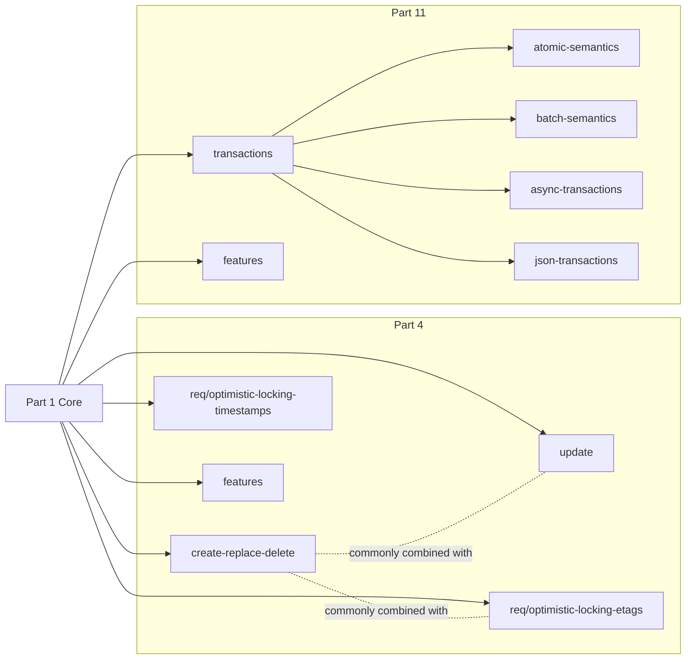

# OGC API - Features (Parts 4 & 11)

Reference and workflow for implementing and validating OGC API - Features compliant
write operations. Backend- and framework-agnostic; applies wherever a service claims
conformance to Part 4 or Part 11.

## Scope

**Part 4 — Create, Replace, Update and Delete.** Canonical URL: <https://docs.ogc.org/DRAFTS/20-002r1.html>

Defines server behaviour for `POST`, `PUT`, `PATCH`, and `DELETE` on **individual
feature resources**. Operations apply to a single resource at a time — no side
effects on other resources. Multi-resource ordering and atomicity are Part 11
territory.

**Part 11 — Atomic and Batch Transactions.** Canonical URL: <https://docs.ogc.org/DRAFTS/23-057r1.html>

*(Draft — not yet independently verified in this skill.)*

Defines a `/transactions` endpoint that accepts a transaction document grouping
multiple operations into a single request. Key use case: topologically related
changes that must succeed or fail together (e.g. splitting a polygon updates both
resulting features). Supports atomic (all-or-nothing) and batch (partial-success)
semantics.

Depends on (assumed already conformant, out of scope for this skill):

- Part 1 — Core: <http://docs.ogc.org/is/17-069r4/17-069r4.html>
- Part 2 — CRS by Reference: <http://docs.ogc.org/is/18-058r1/18-058.html>

**Conformance URIs are opaque identifiers** — not resolvable URLs. Exact character
spelling is what matters for conformance; do not "fix" them.

## When to Use

Load this skill when the user is:

1. Adding or changing any endpoint that creates, replaces, updates, or deletes
   features (typically `POST` / `PUT` / `PATCH` / `DELETE` on
   `/collections/{collectionId}/items` or `/{featureId}`).
2. Reviewing whether an existing write endpoint is spec-compliant.
3. Declaring or updating conformance URIs advertised by a `/conformance` endpoint.
4. Deciding response status codes, required headers (`Location`, `ETag`,
   `Last-Modified`, `Prefer` / `Preference-Applied`), or media types.
5. Designing a batch or atomic transaction endpoint (Part 11).
6. Writing contract tests against the Abstract Test Suites in the specs.

Do **not** load this skill for:

- Read-only feature queries (Part 1 — out of scope).
- Pure database/DDL work with no HTTP surface.
- Domain-model questions unrelated to the HTTP API.

## Procedure

Always read the governing spec section before implementing or reviewing.
Reference files distil the spec — the spec has final authority.

### 1. Find the governing spec section

| What you're building | Where to look |
|----------------------|---------------|
| Single-feature CRUD (`POST`/`PUT`/`PATCH`/`DELETE` on `/collections/{cid}/items[/{fid}]`) | [references/part-4-crud.md](./references/part-4-crud.md) |
| Multi-feature transactions | [Part 11 draft](https://docs.ogc.org/DRAFTS/23-057r1.html) directly (TODO: `references/part-11-transactions.md`) |

### 2. Declare the conformance class

Every capability you implement must be declared in `/conformance`. Conformance class
URIs (`conf/…`) are listed at the top of each Requirements Class section in
[part-4-crud.md](./references/part-4-crud.md). Undeclared capabilities break discovery.

### 3. Check HTTP semantics

For HTTP concept definitions (status codes, headers, conditional requests, `Prefer`),
see [references/http-semantics.md](./references/http-semantics.md). The concrete
requirement IDs that bind specific codes and headers to specific operations are in
the governing spec section from step 1.

### 4. Cite requirement IDs

Cite the requirement ID in the PR description or code comment (e.g.
`/req/create-replace-delete/post-response`). For Part 11: always verify directly
against the draft spec — this skill has not independently verified Part 11.

### 5. Update contract tests

Add or update tests covering the new behaviour.

## References

Reference files are built out incrementally as we work through the specs together.
Missing files mean "not yet written" — ask before assuming a topic is covered.

- [Part 4 — CRUD on features](./references/part-4-crud.md)
- Part 11 — Atomic and Batch Transactions (TODO: `references/part-11-transactions.md` not yet written)
- [HTTP semantics (status codes, headers)](./references/http-semantics.md)
- Media types and GeoJSON payload rules (TODO: `references/media-types.md` not yet written)

## Anti-patterns

- **Paraphrasing requirements.** Always quote or cite the requirement ID; the wording
  matters for conformance.
- **Skipping `/conformance` updates.** Adding a new capability without declaring its
  conformance URI breaks discovery.
- **Reusing `POST` for updates.** Part 4 uses `PUT` for full replace and `PATCH` for
  partial update — do not overload `POST`.
- **Silently changing feature `id`.** The server-assigned id on `POST` must be
  returned via `Location` header; existing ids are immutable on `PUT`/`PATCH`.
- **Batch = Atomic.** Part 11 distinguishes them: batch allows partial success,
  atomic is all-or-nothing. Do not conflate.
