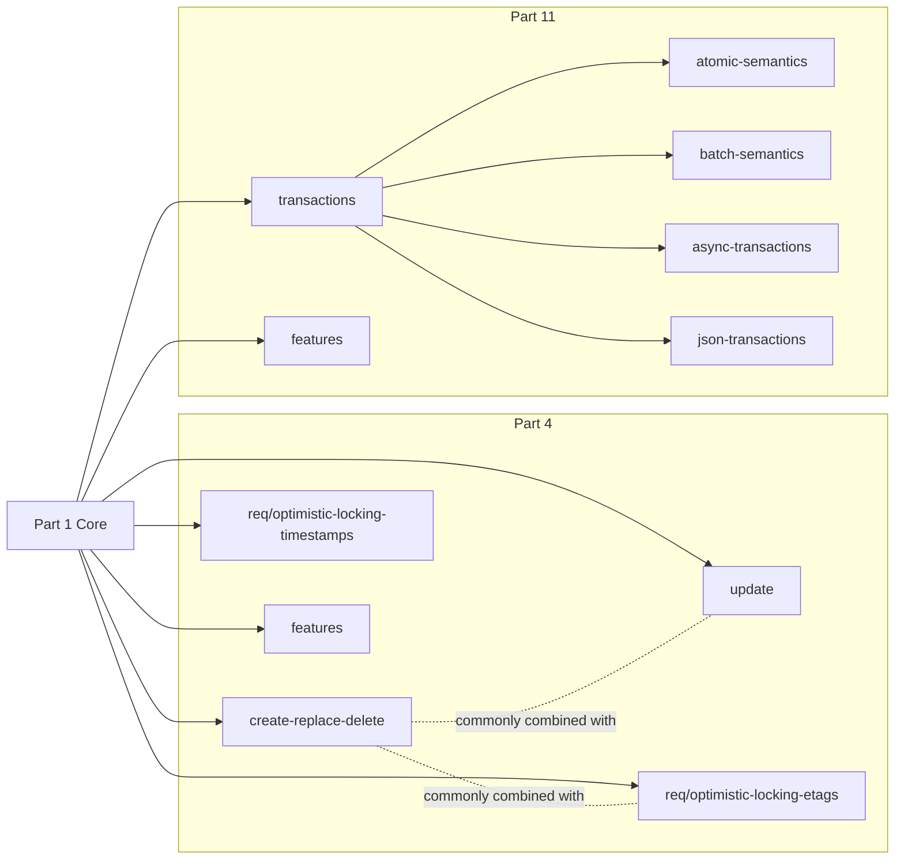

# OGC API - Features (Parts 4 & 11)

Reference and workflow for implementing and validating OGC API - Features compliant
write operations. Backend- and framework-agnostic; applies wherever a service claims
conformance to Part 4 or Part 11.

## Scope

**Part 4 — Create, Replace, Update and Delete.** Canonical URL: <https://docs.ogc.org/DRAFTS/20-002r1.html>

Defines server behaviour for `POST`, `PUT`, `PATCH`, and `DELETE` on **individual
feature resources**. Operations apply to a single resource at a time — no side
effects on other resources. Multi-resource ordering and atomicity are Part 11
territory.

**Part 11 — Atomic and Batch Transactions.** Canonical URL: <https://docs.ogc.org/DRAFTS/23-057r1.html>

*(Draft — not yet independently verified in this skill.)*

Defines a `/transactions` endpoint that accepts a transaction document grouping
multiple operations into a single request. Key use case: topologically related
changes that must succeed or fail together (e.g. splitting a polygon updates both
resulting features). Supports atomic (all-or-nothing) and batch (partial-success)
semantics.

Depends on (assumed already conformant, out of scope for this skill):

- Part 1 — Core: <http://docs.ogc.org/is/17-069r4/17-069r4.html>
- Part 2 — CRS by Reference: <http://docs.ogc.org/is/18-058r1/18-058.html>

**Conformance URIs are opaque identifiers** — not resolvable URLs. Exact character
spelling is what matters for conformance; do not "fix" them.

## When to Use

Load this skill when the user is:

1. Adding or changing any endpoint that creates, replaces, updates, or deletes
   features (typically `POST` / `PUT` / `PATCH` / `DELETE` on
   `/collections/{collectionId}/items` or `/{featureId}`).
2. Reviewing whether an existing write endpoint is spec-compliant.
3. Declaring or updating conformance URIs advertised by a `/conformance` endpoint.
4. Deciding response status codes, required headers (`Location`, `ETag`,
   `Last-Modified`, `Prefer` / `Preference-Applied`), or media types.
5. Designing a batch or atomic transaction endpoint (Part 11).
6. Writing contract tests against the Abstract Test Suites in the specs.

Do **not** load this skill for:

- Read-only feature queries (Part 1 — out of scope).
- Pure database/DDL work with no HTTP surface.
- Domain-model questions unrelated to the HTTP API.

## Procedure

Follow these steps for any change touching write endpoints on features.

### 1. Identify the requirements class

Each declared conformance URI **must** be listed in the `/conformance` response.

**Part 4** — namespace prefix `http://www.opengis.net/spec/ogcapi-features-4/1.0/`

| Class | URI suffix | Scope | Spec § |
|-------|-----------|-------|--------|
| Create/Replace/Delete | `conf/create-replace-delete` | `POST` new features; `PUT` replaces; `DELETE` removes. Single-resource only. | [§6](https://docs.ogc.org/DRAFTS/20-002r1.html#create-replace-delete_clause) |
| Update | `conf/update` | `PATCH` an existing feature (partial update). | [§7](https://docs.ogc.org/DRAFTS/20-002r1.html#update_clause) |
| Optimistic Locking (Timestamps) | `req/optimistic-locking-timestamps` | `Last-Modified` on `GET`; `If-Unmodified-Since` on write. | [§8](https://docs.ogc.org/DRAFTS/20-002r1.html#rc_optimistic-locking-timestamps) |
| Optimistic Locking (ETags) | `req/optimistic-locking-etags` | `ETag` on `GET`; `If-Match` on write. | [§8](https://docs.ogc.org/DRAFTS/20-002r1.html#rc_optimistic-locking-etags) |
| Features | `conf/features` | GeoJSON (`application/geo+json`) for feature write payloads. | [§9](https://docs.ogc.org/DRAFTS/20-002r1.html#features_clause) |

> **Spec note:** The two Optimistic Locking classes use `/req/` prefix, not `/conf/`.
> This is deliberate throughout Part 4 (Table 2 and all requirement IDs in §8).

For full requirements, see [references/part-4-crud.md](./references/part-4-crud.md).

**Part 11** *(draft — unverified in this skill)* — namespace prefix `http://www.opengis.net/spec/ogcapi-features-11/1.0/`

| Class | URI suffix | Scope | Spec § |
|-------|-----------|-------|--------|
| Transactions | `conf/transactions` | `/transactions` endpoint accepting a transaction document. | [§6](https://docs.ogc.org/DRAFTS/23-057r1.html#sc_transactions) |
| Atomic Semantics | `conf/atomic-semantics` | All operations succeed or all roll back. | [§7](https://docs.ogc.org/DRAFTS/23-057r1.html#sc_atomic) |
| Batch Semantics | `conf/batch-semantics` | Each operation succeeds or fails independently. | [§8](https://docs.ogc.org/DRAFTS/23-057r1.html#sc_batch) |
| Asynchronous Transactions | `conf/async-transactions` | `Prefer: respond-async`; server returns `202` + polling URL. | [§9](https://docs.ogc.org/DRAFTS/23-057r1.html#sc_async-transactions) |
| JSON Encoding | `conf/json-transactions` | JSON representation of the transaction document. | [§10](https://docs.ogc.org/DRAFTS/23-057r1.html#sc_json) |
| Features | `conf/features` | GeoJSON payloads inside transaction operations. | [§11](https://docs.ogc.org/DRAFTS/23-057r1.html#features_clause) |

> **Part 11 spec inconsistencies:**
> - Table 1 uses `conf/atomic-semantics` / `conf/batch-semantics`; the SHALL clauses
>   in the body text use `conf/atomic-transactions` / `conf/batch-transactions`.
>   **Use the Table 1 URIs.**
> - The JSON class has three names in the same document: "JSON Encoding" (Table 1),
>   "Requirements Class JSON" (§10 heading), and `json-transactions` (URI slug).
>   Reproduce whichever appears in context.

### 2. Match method and URI against the spec

For **Part 4** (single-resource operations):

| Operation | Method | Path |
|-----------|--------|------|
| Create | `POST` | `/collections/{cid}/items` |
| Replace | `PUT` | `/collections/{cid}/items/{fid}` |
| Update | `PATCH` | `/collections/{cid}/items/{fid}` |
| Delete | `DELETE` | `/collections/{cid}/items/{fid}` |

For **Part 11**, the mechanism is different — a transaction document is submitted
to a `/transactions` endpoint. See the [Part 11 draft](https://docs.ogc.org/DRAFTS/23-057r1.html).

For edge cases, body requirements, and status codes: see
[references/part-4-crud.md](./references/part-4-crud.md).

### 3. Validate headers and status codes

Check the request/response header requirements for the chosen operation. See
[references/http-semantics.md](./references/http-semantics.md) for the mapping
of status codes (`201`, `204`, `303`, `412`, `415`, `422`, …) and required headers
(`Location`, `ETag`, `Content-Type`, `Prefer`/`Preference-Applied`).

### 4. Validate payload semantics

Check the spec for the chosen media type’s payload rules. See
`references/media-types.md` (TODO: not yet written).

### 5. Verify against the spec

For **Part 4**: the reference files in this skill have detailed, requirement-level
coverage — use them. Cross-check a specific requirement ID if something is unclear.

For **Part 11**: the skill has not independently verified Part 11. Always cross-reference
directly against the [Part 11 draft](https://docs.ogc.org/DRAFTS/23-057r1.html).
Cite the requirement ID in the PR description or code comment.

### 6. Update contract tests

Add or update tests derived from the Abstract Test Suite (Annex A of each part) so
the change is covered.

## References

Reference files are built out incrementally as we work through the specs together.
Missing files mean "not yet written" — ask before assuming a topic is covered.

- [Part 4 — CRUD on features](./references/part-4-crud.md)
- Part 11 — Atomic and Batch Transactions (TODO: `references/part-11-transactions.md` not yet written)
- [HTTP semantics (status codes, headers)](./references/http-semantics.md)
- Media types and GeoJSON payload rules (TODO: `references/media-types.md` not yet written)

## Anti-patterns

- **Paraphrasing requirements.** Always quote or cite the requirement ID; the wording
  matters for conformance.
- **Skipping `/conformance` updates.** Adding a new capability without declaring its
  conformance URI breaks discovery.
- **Reusing `POST` for updates.** Part 4 uses `PUT` for full replace and `PATCH` for
  partial update — do not overload `POST`.
- **Silently changing feature `id`.** The server-assigned id on `POST` must be
  returned via `Location` header; existing ids are immutable on `PUT`/`PATCH`.
- **Batch = Atomic.** Part 11 distinguishes them: batch allows partial success,
  atomic is all-or-nothing. Do not conflate.
