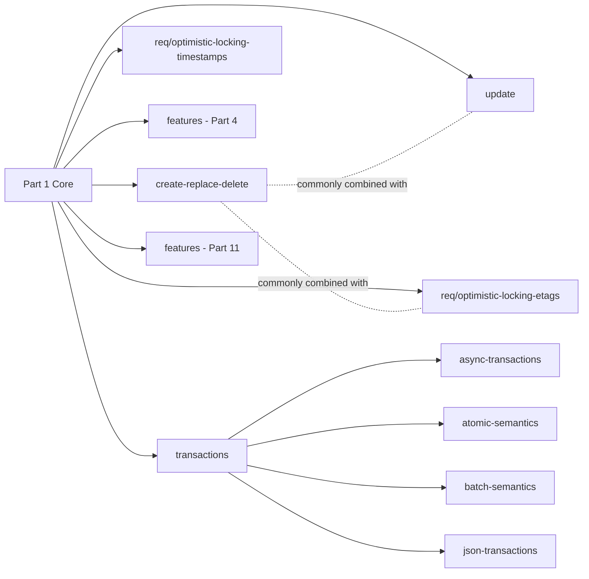

# Conformance Classes — Semantic Map

Purpose of this file: give each Part 4 and Part 11 conformance class a plain-English
meaning so implementers can decide **what capabilities to build** and where in the
specs to look for the requirements. This is a semantic map, not a checklist for
publishing a `/conformance` response.

**Nature of the URIs.** OGC conformance class URIs are *identifiers*, not resolvable
URLs. OGC's convention (from RDF / XML-namespace practice) is that a URI names a
concept and is decoupled from wherever the spec text is hosted. Some redirect via
`opengis.net`, many do not — especially in drafts. Whether they resolve in a browser
has no bearing on conformance; only exact spelling matters. Treat them as opaque
strings; do not "fix" them.

**Draft status.** Part 4 is a published Implementation Standard. **Part 11 is still
in draft** and its URIs contain editorial inconsistencies (see
[§4](#4-known-spec-inconsistencies)). Implementation semantics are stable enough to
build against; conformance-URI advertising is not, and is intentionally
deprioritised in this skill.

**Section references** in the tables below link to the published spec on
`docs.ogc.org`. The local HTML copies in the workspace under
`ogc-standards/` are author-side working copies only.

---

## 1. Part 4 conformance classes

Four requirements-class sections, five class URIs (Optimistic Locking has two
sub-classes). Source: Part 4 §7 Table 2. Namespace prefix
`http://www.opengis.net/spec/ogcapi-features-4/1.0/…`.

| Class name (Table 2) | URI suffix | Capabilities the server must implement | Depends on | Part 4 section |
|----------------------|------------|----------------------------------------|-----------|-----------------|
| Create/Replace/Delete | `conf/create-replace-delete` | `POST` new features to a collection; `PUT` replaces an existing feature by full representation; `DELETE` removes a feature. Correct status codes (`201`, `200`/`204`, `404`, `415`, `422`, …) and `Location` on create. | Part 1 Core | [**§6**](https://docs.ogc.org/DRAFTS/20-002r1.html#create-replace-delete_clause) |
| Update | `conf/update` | `PATCH` an existing feature. Server declares which patch media types it accepts (Merge Patch, JSON Patch, potentially custom). Partial-update semantics. | Part 1 Core; typically combined with Create/Replace/Delete | [**§7**](https://docs.ogc.org/DRAFTS/20-002r1.html#update_clause) |
| Optimistic Locking using Timestamps | `req/optimistic-locking-timestamps` | `Last-Modified` on `GET`; require or accept `If-Unmodified-Since` on write. `412` (or `428`/`409` per §5.6 of [http-semantics](./http-semantics.md)) on stale timestamp. | Part 1 Core | [**§8** sub-class](https://docs.ogc.org/DRAFTS/20-002r1.html#rc_optimistic-locking-timestamps) |
| Optimistic Locking using ETags | `req/optimistic-locking-etags` | `ETag` on `GET`; require or accept `If-Match` on write. `412` on stale ETag. Strong ETags required for `If-Match`. | Part 1 Core | [**§8** sub-class](https://docs.ogc.org/DRAFTS/20-002r1.html#rc_optimistic-locking-etags) |
| Features | `conf/features` | Support GeoJSON (`application/geo+json`) as the request/response body format for feature writes. | Part 1 Core "Features (GeoJSON)" (`ogcapi-features-1/1.0/conf/geojson`) | [**§9**](https://docs.ogc.org/DRAFTS/20-002r1.html#features_clause) |

**Note the `/req/` prefix** on the two optimistic-locking classes. This is
deliberate throughout Part 4 (Table 2, the requirements-class definition tables in
§8, and every individual requirement ID inside them). Reproduce it verbatim.

### Choosing between the two optimistic-locking classes

- **ETags** are the stronger option: opaque validator, no clock-drift issues, works
  down to sub-second write intervals. Preferred when you can compute a stable
  `ETag` (row version, content hash, edit counter).
- **Timestamps** rely on `Last-Modified` at one-second resolution. Simpler to
  implement (just an `updated_at` column) but vulnerable to same-second updates.
- A server MAY implement both; declaring both classes lets clients choose their
  preferred mechanism.

---

## 2. Part 11 conformance classes

Six classes across six top-level sections. Source: Part 11 §7 Table 1. Namespace
prefix `http://www.opengis.net/spec/ogcapi-features-11/1.0/…`.

| Class name (Table 1) | URI suffix | Capabilities the server must implement | Depends on | Part 11 section |
|----------------------|------------|----------------------------------------|-----------|-----------------|
| Transactions | `conf/transactions` | A `/transactions` endpoint that accepts a *transaction document* describing one or more feature operations (create / replace / update / delete) and executes them under a single call. | Part 1 Core; typically Part 4 for the underlying operations | [**§6**](https://docs.ogc.org/DRAFTS/23-057r1.html#sc_transactions) |
| Atomic Semantics | `conf/atomic-semantics` | Multi-operation transactions execute **all or none**. Any failure rolls back the whole transaction; response reports the offending operation. | Transactions | [**§7**](https://docs.ogc.org/DRAFTS/23-057r1.html#sc_atomic) |
| Batch Semantics | `conf/batch-semantics` | Multi-operation transactions allow **partial success**. Each operation succeeds or fails independently; response reports per-operation status. | Transactions | [**§8**](https://docs.ogc.org/DRAFTS/23-057r1.html#sc_batch) |
| Asynchronous Transactions | `conf/async-transactions` | Client sends `Prefer: respond-async`; server returns `202 Accepted` + `Location` for a status resource that clients poll until the transaction completes. | Transactions | [**§9**](https://docs.ogc.org/DRAFTS/23-057r1.html#sc_async-transactions) |
| JSON Encoding | `conf/json-transactions` | JSON representation of the transaction document (list of operations, per-op metadata, references). Note the three-way name divergence (see §4.3). | Transactions | [**§10**](https://docs.ogc.org/DRAFTS/23-057r1.html#sc_json) |
| Features | `conf/features` | GeoJSON as the payload format inside transaction operations. | Part 1 Core "Features (GeoJSON)" | [**§11**](https://docs.ogc.org/DRAFTS/23-057r1.html#features_clause) |

### Choosing atomic vs batch

They are **mutually exclusive per transaction call**, not per server. A server MAY
implement both classes and let the client (or the request) select which semantics
apply. Selection mechanism is defined by Part 11 — details go in
`part-11-transactions.md`, out of scope here.

- **Atomic** is what most authoritative-data services want: consistency guarantees
  match a database transaction. Failure signal is a single 4xx/5xx with the failing
  operation identified.
- **Batch** is for ingest pipelines that tolerate partial failure and want to
  process the good rows: response body enumerates each operation's outcome.

---

## 3. Dependency graph



Notes:

- The two Optimistic Locking classes are **independent**. Implement one, both, or
  neither. Not required by any other class.
- Part 11's `transactions` class is independent of Part 4's `create-replace-delete`
  at the URI level, but semantically the transaction operations reuse the same
  create/replace/update/delete verbs. In practice a server implementing Part 11
  will also implement Part 4.
- The `features` class exists separately in both parts because it declares the
  media-type support for that part's payloads.
- Part 11 §5.4 formalises this as "direct" vs "indirect" dependencies — direct
  means the server must conform to the referenced class; indirect means it must
  conform *if* it also declares the related capability.

---

## 4. Known spec inconsistencies

Documented here so downstream work does not silently paper over them.

### 4.1 Part 4 optimistic-locking URIs use `/req/` prefix

Every other conformance class in Part 4 (and Part 11) uses `/conf/…`. The
optimistic-locking classes use `/req/…`. This is consistent throughout the Part 4
document — Table 2 (§7), the requirements-class definition tables in §8, and every
requirement ID inside them (e.g. `/req/optimistic-locking-timestamps/get-last-modified-response`).
It is not a typo. It does make the class URIs look like single-requirement URIs.
Treat them as class URIs.

### 4.2 Part 11 Table 1 vs SHALL-clause URIs

| Location | URI advertised |
|----------|----------------|
| §7 Table 1 (Conformance class URIs)  | `conf/atomic-semantics`, `conf/batch-semantics` |
| SHALL clauses in §7 / §8 body text   | `conf/atomic-transactions`, `conf/batch-transactions` |

Table 1 is the labeled "Conformance class URIs" table and is treated as
authoritative in this skill: **use `atomic-semantics` and `batch-semantics`**.
The SHALL-clause URIs (`-transactions`) are noted as an editorial drift in the
draft; do not silently switch between the two.

### 4.3 Part 11 three-way name divergence for the JSON class

Same class, three different names in the same document:

| Where | Name / slug |
|-------|-------------|
| §7 Table 1, "Conformance class" column   | "JSON Encoding" |
| §10 section heading                       | Requirements Class "JSON" |
| URI slug                                  | `json-transactions` |

Reproduce all three where they appear. Do not rename any of them.

### 4.4 Draft status caveat

Any of the above may change before Part 11 reaches published-standard status. When
that happens, this section is the first thing to revisit.

---

## 5. Implementation decision guide

Priority is building a working, spec-shaped server — not maximising the number of
declared classes.

1. **Minimum viable feature-writing server:**
   - Part 4: `create-replace-delete` + `features`.
   - Nothing from Part 11.
   - Result: clients can `POST`, `PUT`, `DELETE` GeoJSON features.
2. **Add partial updates** when clients want `PATCH`:
   - Part 4: add `update`.
   - Decide which patch media types you accept (Merge Patch is the most common
     starting point).
3. **Add concurrency control** when multiple writers exist:
   - Part 4: add `req/optimistic-locking-etags` (preferred) or
     `req/optimistic-locking-timestamps`, or both.
   - Requires stable `ETag` or reliable `Last-Modified` on `GET`.
4. **Add multi-feature transactions** only when the client actually needs them:
   - Part 11: start with `transactions` + `features` + `json-transactions`.
   - Add `atomic-semantics` for authoritative-data consistency.
   - Add `batch-semantics` for tolerant ingest.
   - Add `async-transactions` last, once synchronous transactions are stable.

---

## 6. `/conformance` response (brief)

Part 1 Core defines the response body of `GET /conformance`; the details live in
Part 1 and are out of scope here. The shape is trivial — a JSON object with a
single `conformsTo` array of URIs:

```json
{
  "conformsTo": [
    "http://www.opengis.net/spec/ogcapi-features-1/1.0/conf/core",
    "http://www.opengis.net/spec/ogcapi-features-1/1.0/conf/geojson",
    "http://www.opengis.net/spec/ogcapi-features-4/1.0/conf/create-replace-delete",
    "http://www.opengis.net/spec/ogcapi-features-4/1.0/conf/features"
  ]
}
```

Because the URIs are identifiers, get them character-perfect: any published tests
will string-compare.