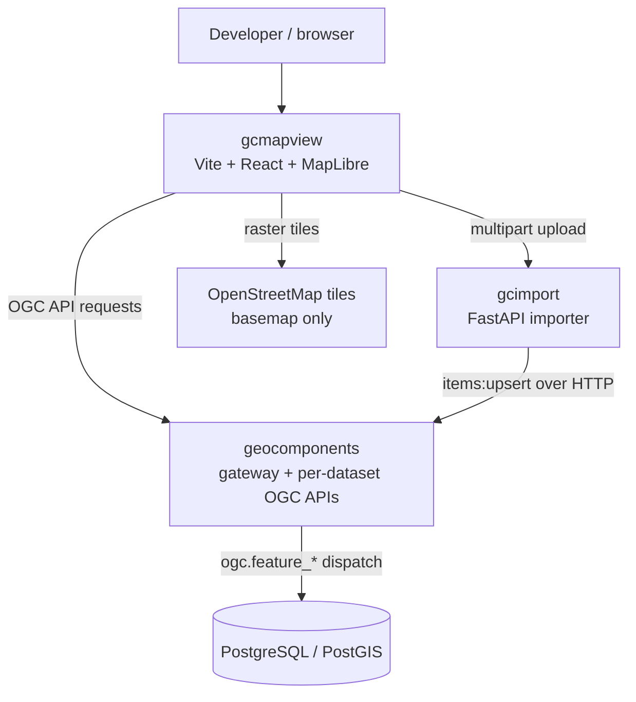
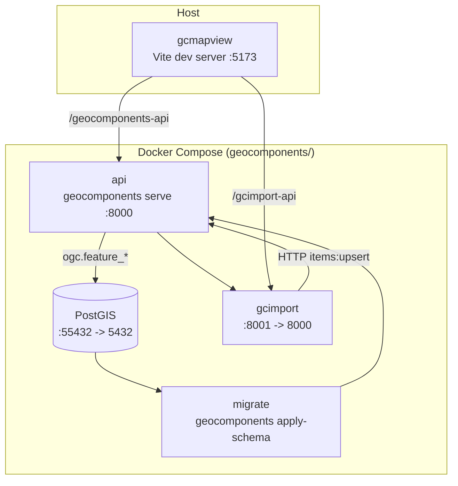
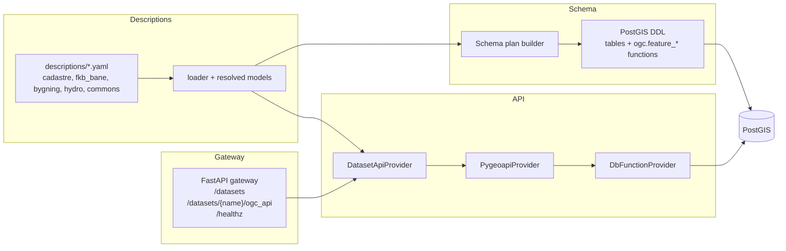
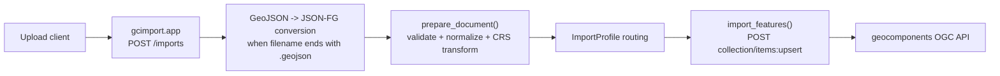
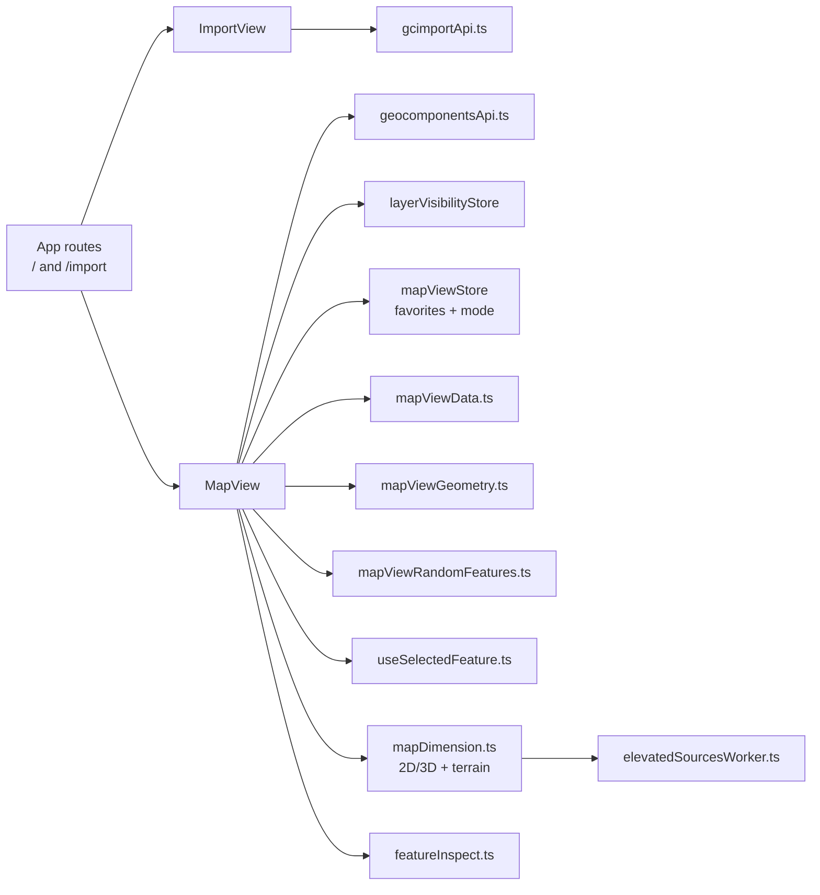
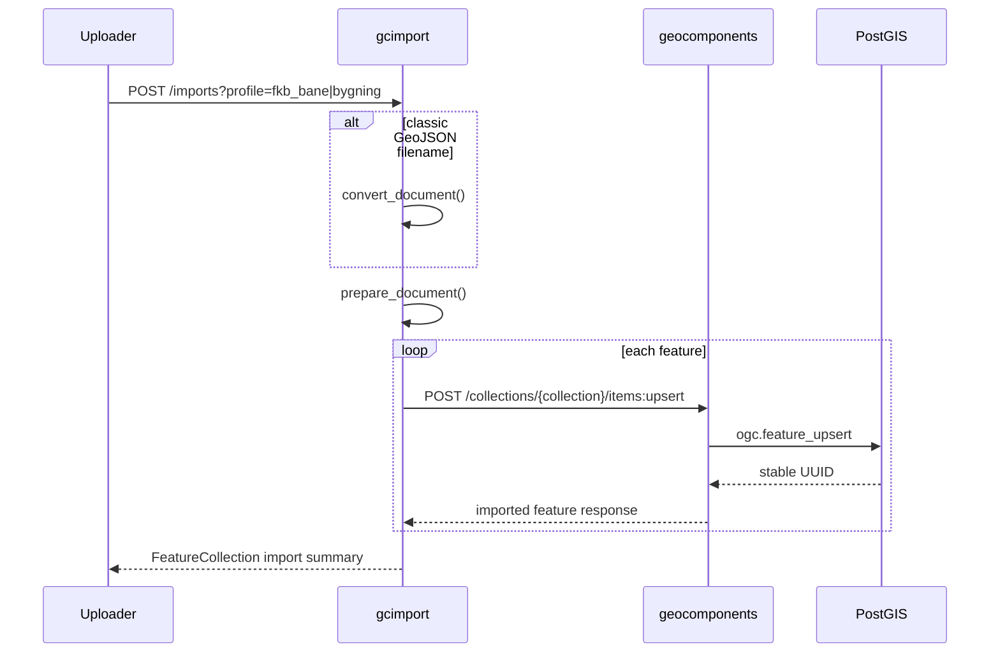
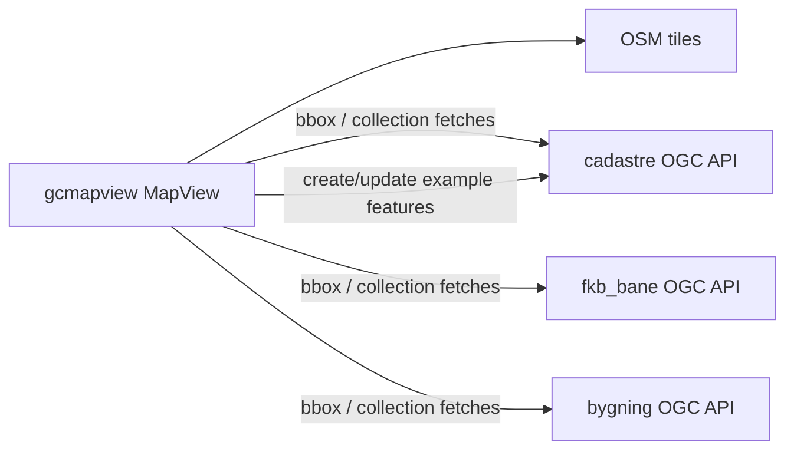
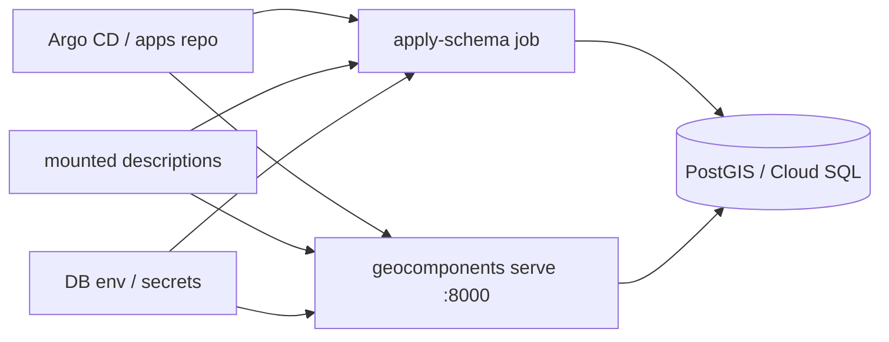

# System architecture

Current overview of **topografisk-gdb-api** as implemented in this workspace: YAML-described topographic datasets become PostGIS schemas and OGC API - Features services through `geocomponents`. `gcimport` validates and transforms uploaded FeatureCollections, then upserts them through the generated OGC API. `gcmapview` is a local developer frontend for inspection, editing of the Cadastre example dataset, and import testing.

The tracked runtime in this repo is centered on HTTP and PostgreSQL/PostGIS. There is no message queue and no tracked background-job service wired into the running stack.

For package-level detail see [geocomponents/README.md](../geocomponents/README.md), [gcimport/README.md](../gcimport/README.md), [gcmapview/README.md](../gcmapview/README.md), and [geocomponents/DEPLOY.md](../geocomponents/DEPLOY.md).

---

## Context



## Monorepo packages

| Package | Role now |
|---------|----------|
| [geocomponents/](../geocomponents/) | Description-driven engine: YAML loader, schema generator, OGC API provider, and gateway |
| [gcimport/](../gcimport/) | Profile-driven synchronous importer for JSON-FG and classic GeoJSON uploads |
| [gcmapview/](../gcmapview/) | Local Vite/React developer map viewer and import UI |
| [gccore/](../gccore/) | Placeholder sibling package directory; no tracked runtime code in this workspace yet |
| [gcjobs/](../gcjobs/) | Placeholder sibling package directory; no tracked runtime code in this workspace yet |
| [nibio/](../nibio/) | AR5 / topology reference material, not part of the live runtime |

---

## Local runtime topology

`make docker-up` starts the backend stack from [geocomponents/docker-compose.yml](../geocomponents/docker-compose.yml) and [geocomponents/docker-compose.override.yaml](../geocomponents/docker-compose.override.yaml). `make frontend-run` starts the frontend on the host.



Notes:

- Vite rewrites `/geocomponents-api` to `http://localhost:8000` and `/gcimport-api` to `http://localhost:8001`.
- `migrate` is the local analog of the production `apply-schema` job.
- `gcmapview` is not containerized in the local default flow.

---

## geocomponents component view

YAML descriptions remain the source of truth. The engine still breaks cleanly into four seams: descriptions, schema, API adapter, and gateway.



The important runtime contract is unchanged: the HTTP layer does not talk to physical dataset tables directly. It delegates reads and writes through the generated `ogc.feature_*` dispatch functions.

| HTTP surface | SQL dispatch |
|--------------|--------------|
| `GET .../items` | `ogc.feature_items` |
| `GET .../items/{id}` | `ogc.feature_item` |
| `POST .../items` | `ogc.feature_create` |
| `PUT` / `PATCH` / `DELETE` | `ogc.feature_replace` / `ogc.feature_update` / `ogc.feature_delete` |
| `POST .../items:upsert` | `ogc.feature_upsert` |

Current dataset descriptions in the repo:

- `cadastre`: editable example parcels/buildings plus topology examples
- `fkb_bane`: projected rail/platform collections in `EPSG:5973`
- `bygning`: projected linework, areas, centerlines, and positions in `EPSG:5972`
- `hydro`: additional example dataset

---

## gcimport component view

`gcimport` is a small FastAPI composition root plus profile definitions and import helpers. In this workspace it exposes a single synchronous upload endpoint, not an async batch/job API.



Current built-in profiles:

- `fkb_bane`: routes source features into `jernbaneplattformkant` and `spormidt`, storing projected `MultiLineString` geometry in `EPSG:5973`
- `bygning`: routes by source `objtype` and geometry into `bygning`, `bygning_omrade`, `bygning_senterlinje`, and `bygning_posisjon` in `EPSG:5972`

Request shape now:

```http
POST /imports?profile=fkb_bane|bygning
Content-Type: multipart/form-data
```

The `profile` query parameter is required on every upload request

Behavior now:

- `.geojson` uploads are converted to JSON-FG before validation.
- JSON is validated before the first upstream request.
- Features are grouped by collection and sent in configurable chunks to `.../processes/upsert-batch/execution`; if that process is unavailable, gcimport falls back to per-feature `.../collections/{collection}/items:upsert`.
- The response reports the stable UUID returned by the upstream API for each imported feature.

---

## gcmapview component view

`gcmapview` is intentionally a developer-facing client, not a general deployment target. It has two routes: `/` for map inspection/editing and `/import` for uploads to `gcimport`.



Current map behavior:

- Cadastre layers are editable in the frontend against the generated OGC API.
- FKB-Bane and Bygning layers are read-only in the frontend.
- Bygning currently includes four map collections: `bygning`, `bygning_omrade`, `bygning_senterlinje`, `bygning_posisjon`.
- `featureInspect.ts` resolves clicks back to registered source features for stable inspection.
- `useSelectedFeature.ts` refetches selected features in their storage CRS for accurate coordinate inspection.
- `mapDimension.ts` owns 2D/3D switching, terrain integration, and heavy elevated-source recalculation.
- `workers/elevatedSourcesWorker.ts` offloads elevated source derivation from the main UI thread.
- `mapViewStore.ts` persists named favorite views, active mode, and visibility-related state locally.

---

## Data flows

### Import flow



### Map flow



Frontend rendering specifics that matter architecturally:

- Projected source data is fetched from the API and reprojected client-side for display.
- 3D derived geometry is computed in browser code rather than persisted server-side.
- Terrain-aware and Z-adjusted rendering are visualization concerns in `gcmapview`; source data stays authoritative in the API/database.

---

## Production topology

Production deployment documented in this repo still applies to `geocomponents` only: the engine image is deployed from a separate apps repo, dataset descriptions are mounted at runtime, and schema application is run as a separate one-shot job before the serving application.



Operational points:

- liveness probe: `/healthz`
- readiness probe: `/datasets`
- `apply-schema` is create-if-missing and idempotent for repeated runs
- descriptions are supplied at runtime, not baked into the image
- `gcmapview` remains a local/dev tool by default

---

## Technology snapshot

| Layer | Stack now |
|-------|-----------|
| Languages | Python 3.12, TypeScript, React 19 |
| Backend frameworks | FastAPI, Starlette, Uvicorn, pygeoapi |
| Database | PostgreSQL + PostGIS |
| Frontend | Vite, React Router, MapLibre GL, Zustand, Tailwind |
| Geometry / CRS | PostGIS, pyproj, proj4 |
| Data formats | OGC API - Features, GeoJSON, JSON-FG |

---

## Architectural invariants

1. **YAML descriptions drive schema and API surface**. The repo does not hand-maintain dataset-specific SQL tables or HTTP handlers.
2. **`ogc.feature_*` is the backend contract boundary**. Generated functions isolate the API layer from physical dataset tables.
3. **`gcimport` is profile-driven and synchronous in the current codebase**. It validates first, then upserts feature-by-feature through the OGC API.
4. **`gcmapview` owns visualization-only concerns** such as client reprojection, 2D/3D switching, terrain handling, and derived elevated geometry.
5. **Only `geocomponents` is a documented deployed backend from this repo today**. `gcmapview` is local/dev-focused, and `gccore` / `gcjobs` are not part of the tracked runtime in this workspace.
