# System architecture

Current overview of **topografisk-gdb-api** as implemented in this workspace: YAML-described topographic datasets become PostGIS schemas and OGC API - Features services through `geocomponents`. `gcapi` is the canonical public boundary and a thin reverse proxy rather than a discovery/rewrite facade, but it is still responsible for checking authorization with `gccore` before proxying browser-facing traffic. Most paths proxy straight to `geocomponents`; dataset-scoped import execution paths under `/datasets/{dataset}/ogc_api/processes/import...` and dataset-scoped job paths under `/datasets/{dataset}/ogc_api/jobs...` proxy to `gcjobs`. `gcapi` does not synthesize OpenAPI, discover collections, or rewrite upstream JSON/link payloads. `gcimport` validates and transforms uploaded FeatureCollections, upserts them through the generated OGC API, and appends import lifecycle events to a Redis Stream. `gcjobs` discovers datasets from the shared descriptions at startup, accepts import requests from `gcapi` through dataset-scoped OGC routes, proxies them to `gcimport` in the background, consumes those lifecycle events through a Redis consumer group, persists them, and exposes dataset-local import-status APIs. `gcjobs` also emits public dataset/job URLs from `GCJOBS_API_BASE_URL`, which is pointed at `gcapi` in local browser-facing deployments. `gccore` is the authorization and core-service dependency for `gcapi`, alongside its health checks and Alembic-managed tables in the shared `gc_core` schema. `gcmapview` remains a developer frontend for inspection, editing of the Cadastre example dataset, and import testing through `gcapi`.

The tracked runtime in this repo is now centered on HTTP, PostgreSQL/PostGIS, and Redis. For the current POC there is one event flow only: `gcimport` appends import events to a Redis Stream, `gcjobs` consumes and acknowledges them through a consumer group, and `gcjobs` PostgreSQL is the durable source of truth for import tracking.

For package-level detail see [geocomponents/README.md](../geocomponents/README.md), [gcimport/README.md](../gcimport/README.md), [gcmapview/README.md](../gcmapview/README.md), and [geocomponents/DEPLOY.md](../geocomponents/DEPLOY.md).

---

## Context

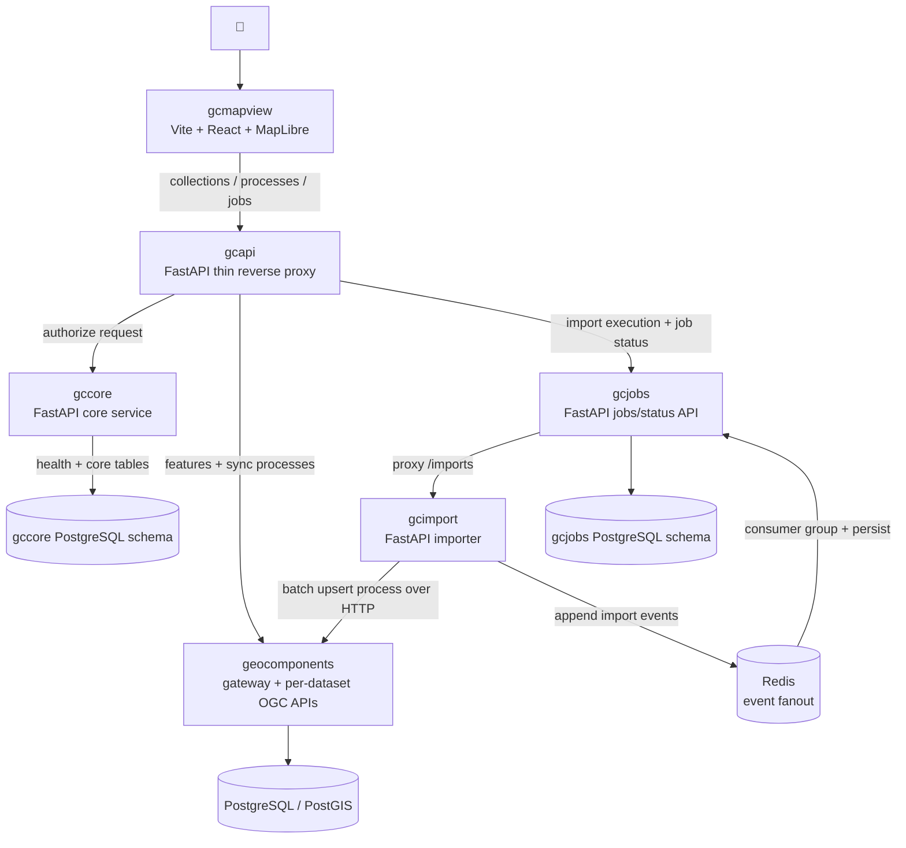

## Monorepo packages

| Package | Role now |
|---------|----------|
| [geocomponents/](../geocomponents/) | Description-driven engine: YAML loader, schema generator, OGC API provider, and gateway |
| [gcapi/](../gcapi/) | Thin FastAPI edge proxy exposing the browser-facing OGC surface over `geocomponents` and `gcjobs`, with authorization delegated to `gccore` |
| [gcimport/](../gcimport/) | Profile-driven synchronous importer for JSON-FG and classic GeoJSON uploads plus import-event emission |
| [gcmapview/](../gcmapview/) | Local Vite/React developer map viewer and import UI |
| [gccore/](../gccore/) | Small FastAPI core service that backs `gcapi` authorization decisions and owns `/`, `/healthz`, and Alembic-managed tables in schema `gc_core` |
| [gcjobs/](../gcjobs/) | Lightweight jobs/status service: accepts imports asynchronously, consumes Redis Stream import events, persists run history, and exposes current/history APIs |
| [nibio/](../nibio/) | AR5 / topology reference material, not part of the live runtime |

---

## Local runtime topology

`make docker-up` starts the local runtime from [geocomponents/docker-compose.yml](../geocomponents/docker-compose.yml) and [geocomponents/docker-compose.override.yaml](../geocomponents/docker-compose.override.yaml), including containerized `gcmapview` on port `8080`. `make frontend-run` is the optional host Vite alternative on port `5173`.

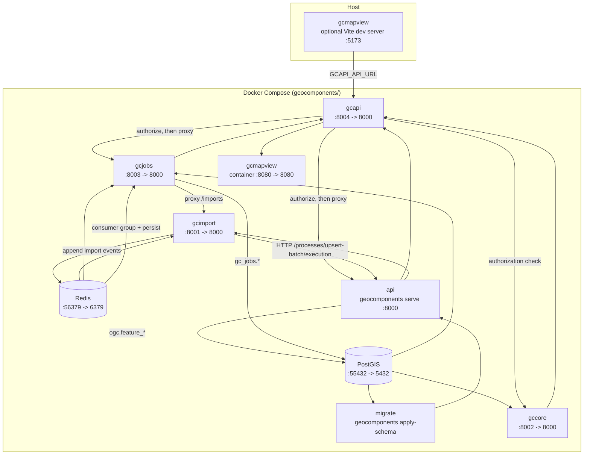

Notes:

- `make docker-up` serves `gcmapview` from the container at `http://localhost:8080`; `make frontend-run` serves the same UI from Vite at `http://localhost:5173`.
- Both frontend modes should target `gcapi` on `http://localhost:8004` through `/datasets/{dataset}/ogc_api/...` for collections, processes, jobs, and import execution.
- `gcapi` depends on `gccore` for authorization of browser-facing requests before it proxies to `geocomponents` or `gcjobs`.
- `gcimport` listens on port `8001` locally but is called internally by `gcjobs`, not directly by the browser-facing import UI.
- Local compose sets `GCJOBS_API_BASE_URL=http://localhost:8004` so `gcjobs` returns browser-facing job URLs on the `gcapi` origin even though the service itself is exposed on `:8003`.
- `geocomponents` on `:8000`, `gcjobs` on `:8003`, and `gccore` on `:8002` remain host-exposed for diagnostics, contract testing, and service-local inspection, but not for direct browser use.
- `migrate` is the local analog of the production `apply-schema` job.
- `gccore` is available locally on `http://localhost:8002`, serves `POST /authorize` for `gcapi`, and reports service health plus Alembic revision state through `/healthz`.

---

## gcapi component view

`gcapi` is intentionally narrow in the current codebase. It is a FastAPI composition root around four concerns only: configuration, request authorization, upstream selection, and byte-preserving proxy transport.

```mermaid
flowchart LR
  CLIENT["Browser / client"] --> ROUTES["gcapi routes<br/>/healthz<br/>/<proxy_path>"]
  ROUTES --> AUTH["authorization middleware"]
  AUTH --> CACHE["TTL cache<br/>client_id:*<br/>600s / 1024 entries"]
  AUTH --> CORE["POST {GCAPI_GCCORE_URL}/authorize<br/>{\"client_id\": null}"]
  ROUTES --> PICK["upstream selector<br/>gcjobs regex vs default"]
  PICK --> GEO["GCAPI_GEOCOMPONENTS_URL"]
  PICK --> JOBS["GCAPI_GCJOBS_URL"]
  GEO --> PROXY["proxy_request()<br/>method + path + query + headers + body"]
  JOBS --> PROXY
```

Current responsibilities:

- expose only one local non-proxy endpoint: `GET /healthz`
- skip authorization only for `OPTIONS` requests and `/healthz`
- call `POST {GCAPI_GCCORE_URL}/authorize` for every other request using the current placeholder client context `{"client_id": null}`
- cache successful authorization decisions in process for 10 minutes with a `client_id`-derived key to avoid repeated `gccore` round-trips
- route `/datasets/{dataset}/ogc_api/processes/import...` and `/datasets/{dataset}/ogc_api/jobs...` to `gcjobs` when `GCAPI_GCJOBS_URL` is configured
- proxy every other path to `geocomponents` using the incoming method, path, query string, headers, and body without response rewriting
- expose proxy-relevant response headers to browsers through CORS: `Location`, `Link`, `ETag`, `Content-Crs`, `Preference-Applied`

## gccore component view

`gccore` is a small FastAPI core service. In the current implementation it has three public routes, derives shared-database connectivity from `DB_*` variables, and owns Alembic-managed tables in schema `gc_core`.

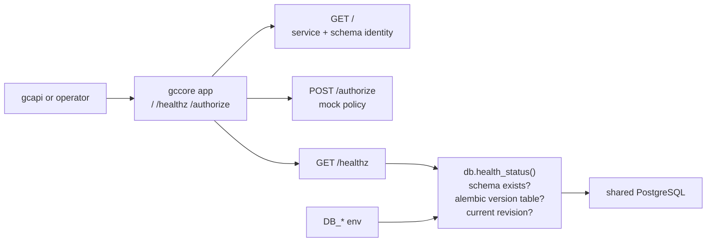

Current responsibilities:

- return service identity from `GET /` as `{"service": "gccore", "schema": "gc_core"}`
- report database-backed health from `GET /healthz`, including schema presence and current Alembic revision when reachable
- return `503` from `/healthz` when the database is misconfigured or unavailable
- own the `gc_core` schema and its Alembic migration history in the shared PostgreSQL database
- implement the current mock authorization seam for `gcapi`: `POST /authorize` authorizes only when `client_id` is `null` and echoes the provided client identifier

---

## geocomponents component view

YAML descriptions remain the source of truth. The engine still breaks cleanly into four seams: descriptions, schema, API adapter, and gateway.

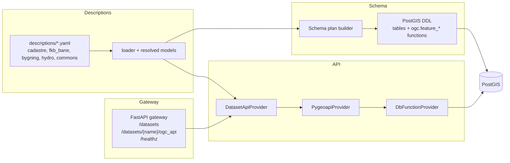

The important runtime contract is unchanged: the HTTP layer does not talk to physical dataset tables directly. It delegates single-feature reads and writes through the generated `ogc.feature_*` dispatch functions, and atomic multi-feature writes through `ogc.transaction`.

| Surface | SQL dispatch |
|---------|--------------|
| `GET .../items` | `ogc.feature_items` |
| `GET .../items/{id}` | `ogc.feature_item` |
| `POST .../items` | `ogc.feature_create` |
| `PUT` / `PATCH` / `DELETE` | `ogc.feature_replace` / `ogc.feature_update` / `ogc.feature_delete` |
| `POST .../items:upsert` | `ogc.feature_upsert` |
| Atomic multi-feature write | `ogc.transaction` |

Current dataset descriptions in the repo:

- `cadastre`: editable example parcels/buildings plus topology examples
- `fkb_bane`: projected rail/platform collections in `EPSG:5973`
- `bygning`: projected linework, areas, centerlines, and positions in `EPSG:5972`
- `hydro`: additional example dataset

---

## gcimport component view

`gcimport` is a small FastAPI composition root plus profile definitions and import helpers. In this workspace it still exposes a synchronous upload endpoint, and it appends import lifecycle events to a Redis Stream while `gcjobs` owns public import start and tracking.

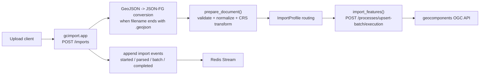

Current built-in profiles:

- `fkb_bane`: routes source features into `jernbaneplattformkant` and `spormidt`, storing projected `MultiLineString` geometry in `EPSG:5973`
- `bygning`: routes by source `objtype` and geometry into `bygning`, `bygning_omrade`, `bygning_senterlinje`, and `bygning_posisjon` in `EPSG:5972`

Request shape now:

```http
POST /datasets/fkb_bane/ogc_api/processes/import/execution
POST /datasets/bygning/ogc_api/processes/import/execution
Content-Type: multipart/form-data
```

The public import process determines the underlying import profile.

Behavior now:

- `.geojson` uploads are converted to JSON-FG before validation.
- JSON is validated before the first upstream request.
- Features are grouped by collection and sent in configurable chunks to `.../processes/upsert-batch/execution`; if that process is unavailable, gcimport fails the import.
- Import lifecycle events are appended at parse start, parse completion, per-batch success/failure, and final success/failure.
- Redis Streams are the single event transport from `gcimport` back to `gcjobs`.
- The response reports the stable UUID returned by the upstream API for each imported feature.

---

## gcjobs component view

`gcjobs` is intentionally small in the current POC. It owns dataset-scoped public process execution and import tracking state for asynchronous imports. Its durable model is PostgreSQL in the `gc_jobs` schema, and it updates that model by consuming Redis Stream events through a consumer group while the frontend polls status over HTTP. Public dataset/job URLs are emitted from the configured `GCJOBS_API_BASE_URL` so browser clients can stay on the `gcapi` address.

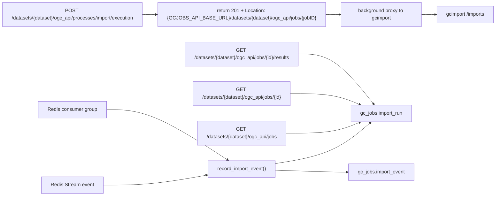

Current responsibilities:

- persist one summary row per import run in `gc_jobs.import_run`
- append raw lifecycle events in `gc_jobs.import_event`
- load dataset mounts from the shared descriptions directory at startup and fail fast if it is missing or empty
- accept dataset-scoped process execution requests immediately and return `201 Created` with a public dataset job resource location before import execution completes
- expose OGC-style job read models at `/datasets/{dataset}/ogc_api/jobs`, `/datasets/{dataset}/ogc_api/jobs/{jobID}`, and `/datasets/{dataset}/ogc_api/jobs/{jobID}/results`
- emit dataset/job links and `Location` headers from `GCJOBS_API_BASE_URL`
- consume and acknowledge Redis Stream import events; Redis is transport, `gcjobs` PostgreSQL is the durable source of truth

---

## gcmapview component view

`gcmapview` is intentionally a developer-facing client, not a general deployment target. It has two routes: `/` for map inspection/editing and `/import` for uploads that now start through `gcapi` process execution endpoints while job polling also goes through `gcapi`.

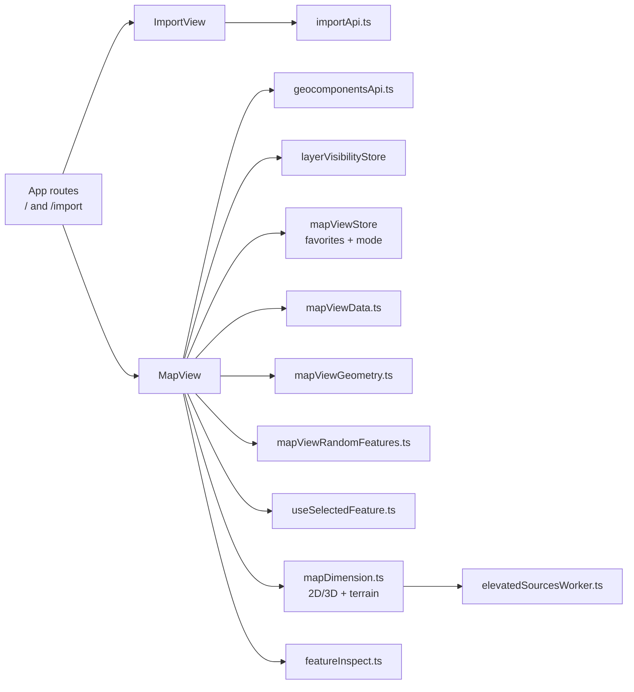

Current map behavior:

- Cadastre layers are editable in the frontend against the generated OGC API.
- FKB-Bane and Bygning layers are read-only in the frontend.
- Bygning currently includes four map collections: `bygning`, `bygning_omrade`, `bygning_senterlinje`, `bygning_posisjon`.
- `featureInspect.ts` resolves clicks back to registered source features for stable inspection.
- `useSelectedFeature.ts` refetches selected features in their storage CRS for accurate coordinate inspection.
- `mapDimension.ts` owns 2D/3D switching, terrain integration, and heavy elevated-source recalculation.
- `workers/elevatedSourcesWorker.ts` offloads elevated source derivation from the main UI thread.
- `mapViewStore.ts` persists named favorite views, active mode, and visibility-related state locally.

---

## Data flows

### Authorization flow

In the current implementation, every browser-facing request enters through `gcapi`. `OPTIONS` and `/healthz` are exempt; every other request triggers a `gccore` authorization check before any upstream proxy hop to `geocomponents` or `gcjobs`.

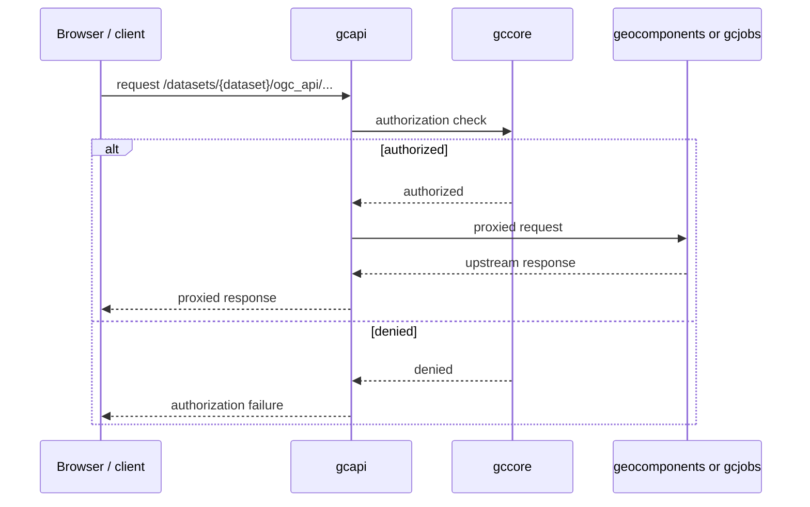

### Import flow

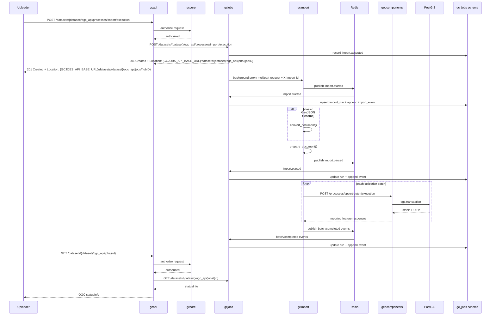

### Message flow

This is the specific import-message path as it exists in the current POC: `gcapi` owns the public OGC process/job surface, `gcjobs` owns durable internal import state, `gcjobs` returns a created job resource immediately, Redis is the single event transport from `gcimport`, and the frontend polls `gcapi` job resources for progress.

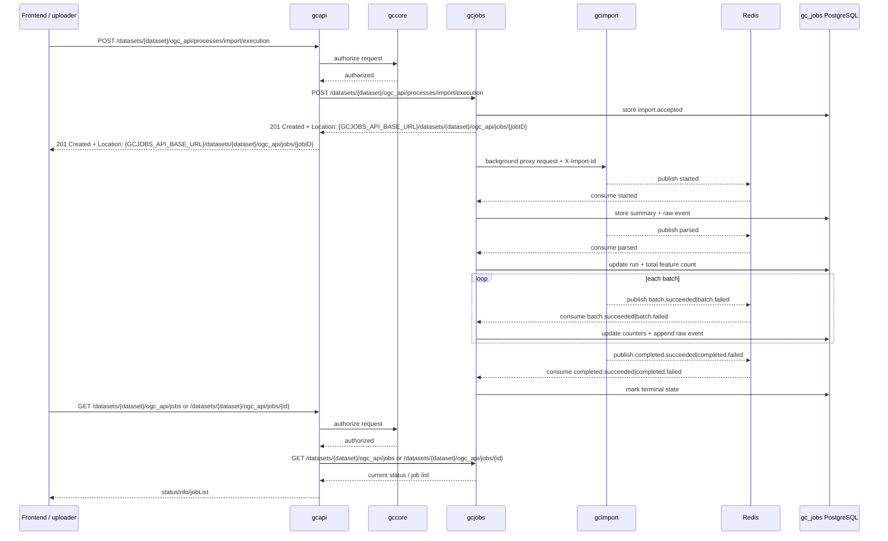

### Map flow

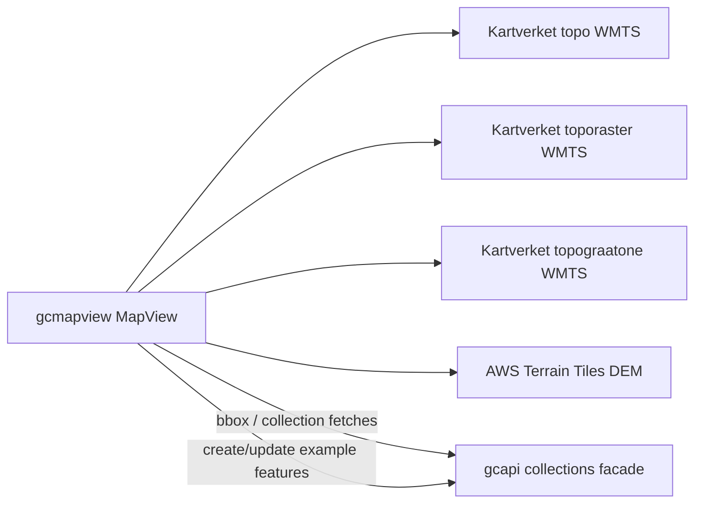

Frontend rendering specifics that matter architecturally:

- Projected source data is fetched from the API and reprojected client-side for display.
- 3D derived geometry is computed in browser code rather than persisted server-side.
- The map background is not OpenStreetMap; users can switch between Kartverket `topo`, `toporaster`, and `topograatone`, or disable the background entirely.
- Terrain-aware and Z-adjusted rendering are visualization concerns in `gcmapview`; source data stays authoritative in the API/database.
- Import progress is not pushed to the browser from Redis; the browser polls `gcapi` job resources, `gcapi` first checks authorization with `gccore`, and then reads durable import state from `gcjobs`.

---

## Production topology

Production deployment documented in this repo still applies primarily to `geocomponents`: the engine image is deployed from a separate apps repo, dataset descriptions are mounted at runtime, and schema application is run as a separate one-shot job before the serving application. The newer `gcjobs` and Redis-backed import-tracking path is implemented in this workspace, but its deployment shape is still evolving and is not yet documented here as a production-standard topology. The current `gcapi` implementation expects a reachable `gccore` deployment for authorization before requests reach those downstream services.

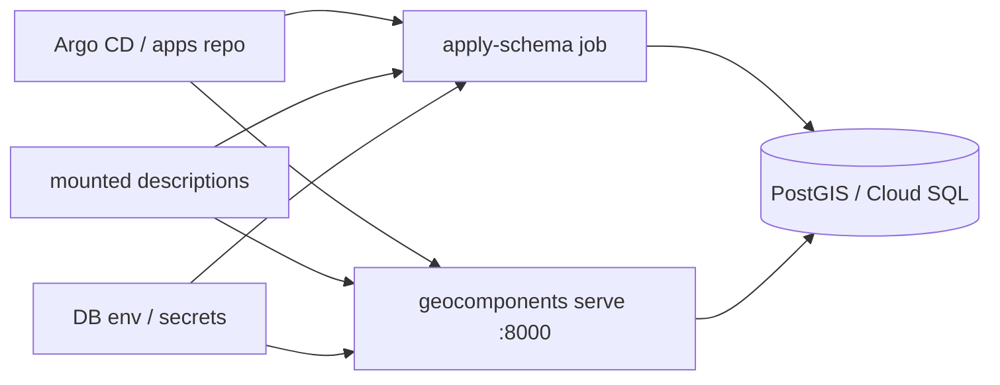

Operational points:

- liveness probe: `/healthz`
- readiness probe: `/datasets`
- `apply-schema` is create-if-missing and idempotent for repeated runs
- descriptions are supplied at runtime, not baked into the image
- `gcmapview` remains a local/dev tool by default

---

## Technology snapshot

| Layer | Stack now |
|-------|-----------|
| Languages | Python 3.12, TypeScript, React 19 |
| Backend frameworks | FastAPI, Starlette, Uvicorn, pygeoapi |
| Database | PostgreSQL + PostGIS, Redis |
| Frontend | Vite, React Router, MapLibre GL, Zustand, Tailwind |
| Geometry / CRS | PostGIS, pyproj, proj4 |
| Data formats | OGC API - Features, GeoJSON, JSON-FG |
---

## Architectural invariants

1. **YAML descriptions drive schema and API surface**. The repo does not hand-maintain dataset-specific SQL tables or HTTP handlers.
2. **`ogc.feature_*` and `ogc.transaction` are the backend contract boundary**. Generated dispatch functions isolate the API and process layers from physical dataset tables.
3. **`gcimport` is profile-driven and synchronous in the current codebase**. It validates first, then imports in collection batches through the OGC API batch process while emitting lifecycle events to Redis.
4. **`gcmapview` owns visualization-only concerns** such as client reprojection, 2D/3D switching, terrain handling, and derived elevated geometry.
5. **`gcjobs` owns durable import-tracking state in the current POC**. It accepts internal import requests from `gcapi` immediately and persists event-derived state in PostgreSQL.
6. **`gcapi` is the only backend the browser should call** for feature access, process execution, job status, and job results, and it authorizes those requests through `gccore` before proxying them. `gcjobs` should emit browser-facing job URLs through `GCJOBS_API_BASE_URL` so those links stay on the `gcapi` origin.
7. **`gccore` is the authorization dependency for `gcapi` at the public edge**. The edge proxy may stay thin, but authorization policy should be centralized in `gccore` rather than duplicated in frontend clients or downstream dataset services.
8. **Only `geocomponents` has a stable production deployment description in this repo today**. `gcmapview` is local/dev-focused, and the newer `gcapi`/`gcjobs`/Redis topology is tracked in code but not yet fully described as production infrastructure.
