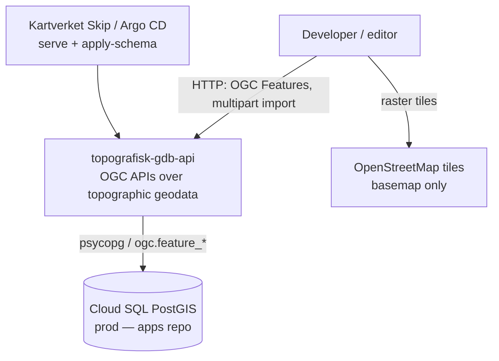
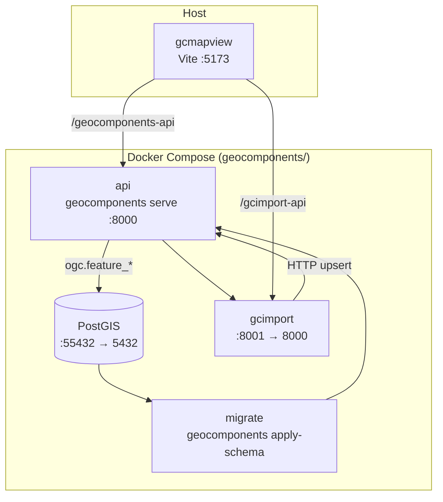
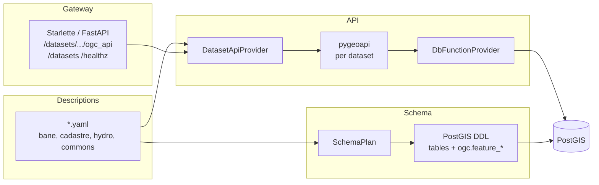
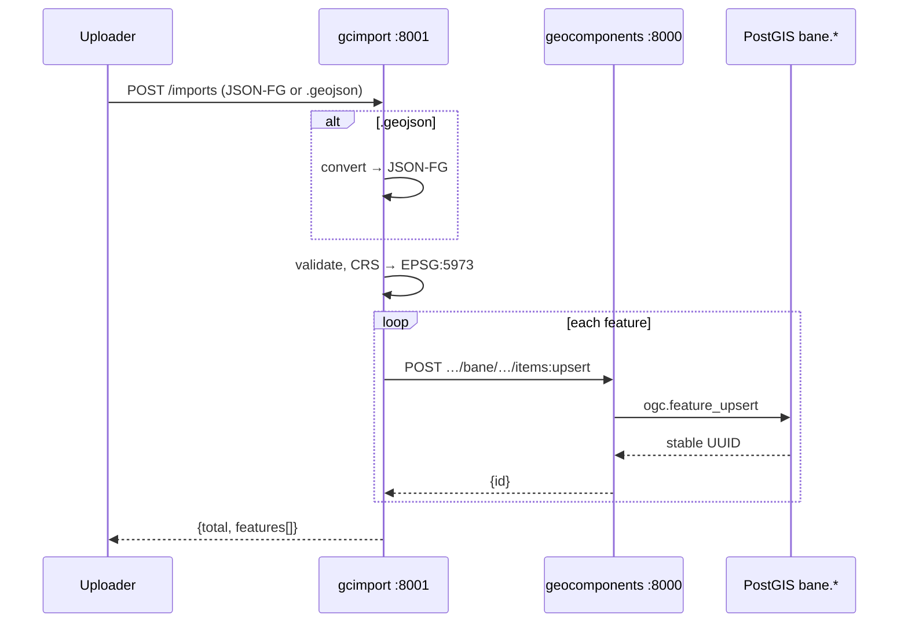
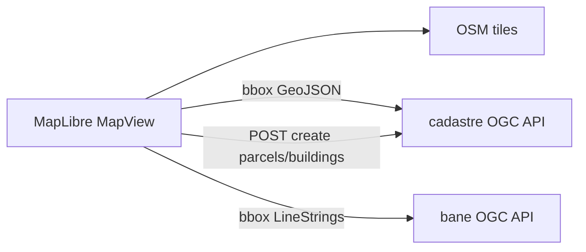
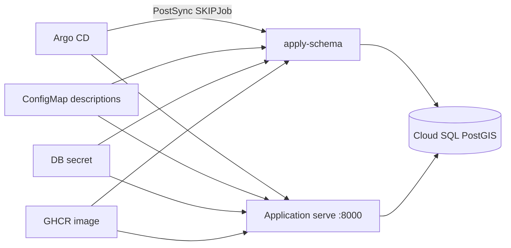

# System architecture

Overview of **topografisk-gdb-api**: YAML-described topographic datasets become PostGIS schemas and OGC API — Features services. Import and map viewing sit beside that engine. There are no message queues — communication is HTTP and PostgreSQL/PostGIS.

For package-level detail see [`geocomponents/README.md`](../geocomponents/README.md), [`gcimport/README.md`](../gcimport/README.md), [`gcmapview/README.md`](../gcmapview/README.md), and [`geocomponents/DEPLOY.md`](../geocomponents/DEPLOY.md).

---

## Context



**Monorepo packages**

| Package | Role |
|---------|------|
| [`geocomponents/`](../geocomponents/) | Engine: YAML → PostGIS DDL + OGC API gateway |
| [`gcimport/`](../gcimport/) | Profile-driven FastAPI importer (JSON-FG / GeoJSON → upsert) |
| [`gcmapview/`](../gcmapview/) | Local Vite/React MapLibre viewer + `/import` UI |
| [`nibio/`](../nibio/) | AR5 topology reference material — not in the live runtime |

---

## Runtime containers (local)



Start with `make docker-up` and `make frontend-run`. Vite proxies API paths; see `gcmapview/vite.config.ts`.

---

## Component view — geocomponents

YAML is the source of truth. Four swappable seams: descriptions → schema → api → gateway.



**Invariant:** the HTTP layer never names physical tables. All reads and writes go through `ogc.feature_*` dispatch into generated `<dataset>._<collection>_<op>` functions.

| HTTP | SQL |
|------|-----|
| `GET …/items` | `ogc.feature_items` |
| `GET …/items/{id}` | `ogc.feature_item` |
| `POST …/items` | `ogc.feature_create` |
| `PUT` / `PATCH` / `DELETE` | `feature_replace` / `update` / `delete` |
| `POST …/items:upsert` | `ogc.feature_upsert` (when `upsert_key` is set) |

Collections are either `simple` (CRUD when configured) or `topology` (read-only until processes/transactions land).

---

## Data flows

### Import (FKB-Bane)



- Profile: `gcimport` Bane rules — collections `jernbaneplattformkant`, `spormidt`; upsert key `(lokalid, identifikasjon_navnerom)`; geometry `LineString` (Z allowed), CRS `EPSG:5973`.
- Offline converter: `geojson-to-jsonfg` (Geonorge-style namespaces and property aliases).

### View / edit (gcmapview)



- Cadastre: editable parcels/buildings in `EPSG:4326`.
- Bane: read-only in the UI; client transforms `EPSG:5973` ↔ WGS84 for display.
- Import UI at `/import` posts to gcimport.

### “Export”

There is no dedicated export pipeline. Clients read GeoJSON via OGC API — Features:

```http
GET /datasets/{name}/ogc_api/collections/{collection}/items?f=json&bbox=…
```

---

## Production topology

Deployed outside this repo (Skip / Argo CD + Cloud SQL). Image entrypoint defaults to `geocomponents serve`; descriptions are mounted at runtime, not baked into the image.



- Probes: liveness `/healthz`, readiness `/datasets`.
- `apply-schema` is idempotent create-if-missing; column migrations are not automatic yet.
- CI publishes **geocomponents** to GHCR; gcmapview is local/dev only.

---

## Technology snapshot

| Layer | Stack |
|-------|--------|
| Languages | Python ≥3.12, TypeScript (React 19) |
| Packaging | `uv` + Hatchling; npm for frontend |
| APIs | FastAPI / Uvicorn / Starlette; **pygeoapi** for OGC Features |
| DB | PostgreSQL + PostGIS (`imresamu/postgis:17-3.6-alpine` locally for ARM64) |
| CRS | pyproj (server), proj4 (browser); SRIDs **4326**, **5973** |
| Frontend | Vite, MapLibre GL, Zustand, Tailwind |
| Standards | OGC API — Features (CRUD Part 4), JSON-FG, GeoJSON |

---

## Architectural invariants

1. **YAML drives schema and API surface** — change descriptions, then `apply-schema` / `serve`.
2. **API ↔ DB contract is `ogc.feature_*` only** — no ad-hoc table SQL from the HTTP layer.
3. **Upsert is first-class for Bane** via `upsert_key` + `items:upsert` (idempotent retries).
4. **gcimport is profile-pluggable** — same `POST /imports`, different dataset rules.
5. **NIBIO / AR5** is preparatory topology material, not part of the live stack yet.
